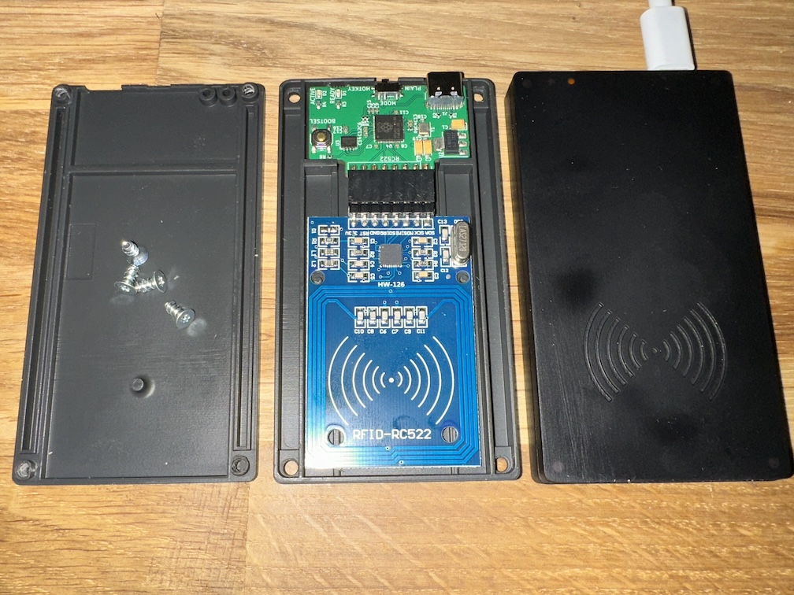

# Bloop NFC Scanner Hardware

[Documentation](https://bloop-box.github.io/nfc-scanner-hardware)

Connect an RC522 based NFC-Reader to your computer using USB

The project is based around a Raspberry Pi [RP2040](https://www.raspberrypi.com/documentation/microcontrollers/rp2040.html) microcontroller. It would have been possible to solve this with a much simpler controller but availability and pricing at the time of development as well as ease of use made the RP2040 with built in USB the best choice. 

The board is designed using KiCAD 6 with production and assembly by JLCPCB in mind. All parts are selected to be available from JLCPCB at the time of writing and as many parts as possible are used from their basic library.

## Case
A simple case design can be found in the case subfolder. It fits when the two boards are connected with standard angled 2.54mm pitch connectors as seen in the picture. 

The two halves can be connected with countersunk M3x8 screws

